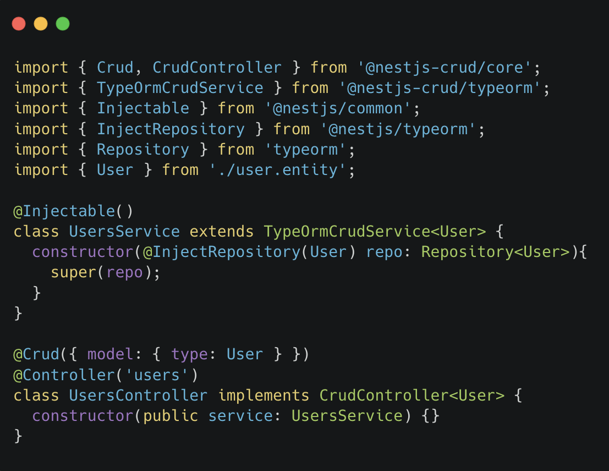

<h1 align="center">
  
</h1>

<p align="center">
  <strong>RESTful APIs for NestJS — from a single <code>@Crud()</code> decorator</strong>
</p>

<p align="center">
  <a href="https://www.npmjs.com/package/@nestjs-crud/core"></a>
  <a href="https://github.com/kodjunkie/nestjs-crud/actions/workflows/tests.yml"></a>
  <a href="LICENSE"></a>
</p>

<br />

Generate eight RESTful endpoints for any NestJS controller — list, paginate, filter, sort, join, nested-join, soft-delete, recover — without writing the handlers.

## Features



- Full-featured CRUD controllers and services, ready to use
- DB- and service-agnostic — extendable base classes per adapter
- Rich query parsing — filters, pagination, sorting, relations, nested relations, cache
- Framework-agnostic query builder for the frontend
- Body, query, and path-param validation built in
- Override any generated handler with `@Override()`
- Tiny config — per-controller or global defaults
- Swagger documentation auto-wired (optional peer)

## Quick start

```bash
npm install @nestjs-crud/core @nestjs-crud/typeorm
```

```ts
@Crud({
  model: { type: User },
  query: { limit: 25, maxLimit: 100, join: { profile: { eager: true } } },
})
@Controller('users')
export class UsersController {
  constructor(public service: UsersService) {}
}
```

You get `GET /users`, `GET /users/:id`, `POST /users`, `POST /users/bulk`, `PATCH /users/:id`, `PUT /users/:id`, `DELETE /users/:id`, `POST /users/:id/recover` — with rich query parsing, pagination, validation, and Swagger.

## Adapters

| Adapter | Package |
| ------- | ------- |
| TypeORM | [`@nestjs-crud/typeorm`](https://www.npmjs.com/package/@nestjs-crud/typeorm) |
| Drizzle | [`@nestjs-crud/drizzle`](https://www.npmjs.com/package/@nestjs-crud/drizzle) |
| MikroORM | [`@nestjs-crud/mikro-orm`](https://www.npmjs.com/package/@nestjs-crud/mikro-orm) |
| Prisma | [`@nestjs-crud/prisma`](https://www.npmjs.com/package/@nestjs-crud/prisma) |

Plus [`@nestjs-crud/core`](https://www.npmjs.com/package/@nestjs-crud/core) (decorator + framework) and [`@nestjs-crud/request`](https://www.npmjs.com/package/@nestjs-crud/request) (frontend query builder).

## Documentation

Full docs live on the [**Wiki**](https://github.com/kodjunkie/nestjs-crud/wiki) — controllers, services, request shape, per-adapter setup, migration guides.

## License & Credits

[MIT](LICENSE). Fork of [`@nestjsx/crud`](https://github.com/nestjsx/crud) at `5.0.0-alpha.3`. See [`NOTICE.md`](NOTICE.md) for full attribution.
